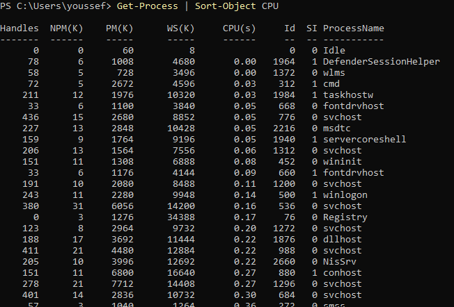
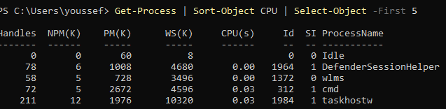

> **Nota**: Els exercicis/pràctiques t'han de servir per a familiarizar-te amb el llenguatge Powershell. Aprofita per a realitzar diverses proves i veure què passa. Documenta també aquestes proves i resultats.
# Tipus de dades

## 1. Identificar tipus

Crea les variables següents:
```powershell
$nom = "Servidor01"
$port = 443
$actiu = $true
$espai = 12.5
```
Consulta el tipus de cadascuna amb:
```powershell
.GetType()
```
Completa una taula com aquesta:

| Variable | Valor        | Tipus |
| -------- | ------------ | ----- |
| $nom     | `Servidor01` | String|
| $port    | `443`        |  Int32|
| $actiu   | $true        |Boolean|
| $espai   | `12.5`       | Double|


Consulta:


## 2. Número o text?

Executa:
```powershell
$a = 10
$b = 5

$a + $b


```
Després:
```powershell
$a = "10"
$b = "5"

$a + $b


```
Respon:

- Quin resultat obtens en cada cas? [Els resultats mostrats en les captures] En el primer cas una suma metamatica, en el segon una suma de text
- Per què no és el mateix?
L'operador + fa una cosa diferent segons el tipus, amb números fa una suma matemàtica: 10 + 5 = 15.En canvi amb textos fa una concatenació : "10" + "5" = "105".

Mostra després el contingut de cadascuna de les variables.



- Quin tipus tenen $a i $b en cada cas?
## 3. Canviar el tipus d'una variable

Executa:
```powershell
$valor = 100
```
Consulta:
```powershell
$valor.GetType()
```
Ara executa:
```powershell
$valor = "100"
```
i torna a consultar:
```powershell
$valor.GetType()
```



Respon:

**Ha canviat el valor? Ha canviat el tipus?**

El valor es veu igual 100, però en realitat és un número en un cas i un text en l'altre.
El tipus sí que ha canviat Int32 a String.

## 4. Tipus explícits

Executa:
```powershell
[int]$port = 443
```
Comprova el tipus:
```powershell
$port.GetType()
```
Ara prova:
```
[string]$portText = 443
```
Consulta també:
```powershell
$portText.GetType()
```


Respon:

**Tot i que visualment els dos valors semblen `443`, són del mateix tipus?**

No. $port és Int32 i $portText és string. Es veuen igual en pantalla, però es comporten diferent per exemple, amb +.

## 5. Booleans

Crea:
```powershell
$serveiActiu = $true
$servidorDisponible = $false
```
Consulta els tipus.

Després mostra un missatge amb:
```
Write-Host "Servei actiu: $serveiActiu"
Write-Host "Servidor disponible: $servidorDisponible"
```


## 6. General

Crea variables per representar un servidor amb aquesta informació:
```
Nom: SRV-WEB01
Port: 443
Espai lliure: 125.7 GB
Actiu: True
```
Després:

1. mostra el valor de totes les variables; consulta el tipus de cadascuna;

Creació i consulta


3. indica quin tipus de dada has utilitzat per cada valor.

